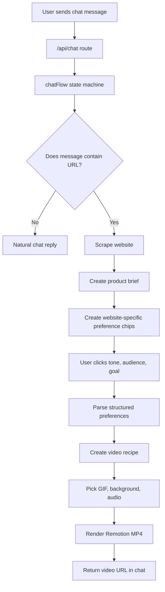

# How The UGC Generator Works

This document explains the app from user input to final video output. The short
version: the user chats with the app, sends a product URL, the server analyzes
the site, the UI asks for creative direction with clickable product-specific
chips, and Remotion renders a short MP4 using selected assets.

## End-To-End Flow



## 1. Frontend Chat

Main files:

- `app/page.jsx`
- `components/Chat.jsx`
- `components/ChatInput.jsx`
- `components/MessageBubble.jsx`
- `components/PreferencePicker.jsx`

The UI starts with one assistant welcome message. When the user sends text,
`components/Chat.jsx` appends the user message locally and calls:

```text
POST /api/chat
```

The request body contains:

```json
{
  "messages": [{ "role": "user", "content": "https://www.calai.app/" }],
  "context": {}
}
```

The `context` object is important. It lets the backend remember what step the
conversation is in:

- `awaiting_preferences`
- `video_ready`
- `needs_product_description`

When the backend returns an assistant message with `status:
"awaiting_preferences"`, the frontend shows the clickable `PreferencePicker`.

## 2. API Route

Main file:

- `app/api/chat/route.js`

This route is intentionally thin. It:

1. Reads `messages` and `context` from the request.
2. Calls `createAssistantReply(messages, context)`.
3. Merges the returned `contextPatch` into the existing context.
4. Sends the assistant message and updated context back to the client.

This keeps HTTP logic separate from the actual conversation logic.

## 3. Conversation State Machine

Main file:

- `lib/chatFlow.js`

`chatFlow.js` decides what to do with each user message.

### Natural Chat

If the user says something like `hi`, it returns a normal greeting.

If the user asks `what can you do?`, it explains that the app creates UGC videos
from product URLs.

### URL Detection

The function `extractUrl()` from `lib/extractUrl.js` checks whether the latest
message includes a URL.

If a URL exists, the app moves into product analysis.

### Preference Step

After URL analysis, the backend returns:

- product summary text
- `preferenceOptions`
- `context.step = "awaiting_preferences"`

The UI uses those `preferenceOptions` to render chips.

### Video Generation Step

When the user clicks `Generate meme video`, the frontend sends a structured
message like:

```text
Tone: Roast my macro math
Audience: macro guessers in denial
Goal: Expose manual logging
```

Because the message is structured, the parser does not need another Claude call.
That saves time.

## 4. Website Scraping And Product Analysis

Main files:

- `lib/scrapeWebsite.js`
- `lib/productAnalyzer.js`
- `lib/anthropic.js`
- `lib/schemas.js`

### Scraping

`scrapeWebsite(url)` fetches the page and extracts:

- title
- meta description
- Open Graph title/description/image
- headings
- CTA-like button/link text
- visible page text
- domain

Cheerio is used for HTML parsing.

### Product Brief

`analyzeProductUrl(url)` turns page facts into a product brief:

```json
{
  "productName": "Cal AI",
  "category": "health and fitness app",
  "targetAudience": "fitness-conscious people",
  "painPoint": "manual calorie logging is annoying",
  "mainBenefit": "track calories by taking a food photo",
  "tone": "modern",
  "cta": "Claim My Free Trial",
  "sourceUrl": "https://www.calai.app/"
}
```

If `ANTHROPIC_API_KEY` is available, Claude improves this analysis. If not,
fallback heuristics infer the category, audience, pain point, and CTA.

### Analysis Cache

Product analysis is cached in memory with `lib/memoryCache.js`, so testing the
same URL again avoids another scrape and AI call.

## 5. Website-Specific Preference Chips

Main file:

- `lib/preferenceOptions.js`

This file creates product-specific, sarcastic options for:

- tone
- audience
- goal

It checks the product brief for category signals.

Examples:

### Fitness / Calorie App

```text
Tone: Roast my macro math
Audience: macro guessers in denial
Goal: Expose manual logging
```

### SaaS / Workflow Tool

```text
Tone: Roast spreadsheet cosplay
Audience: founders doing 14 tabs
Goal: Turn pain into demos
```

### Travel Product

```text
Tone: Roast the planning spreadsheet
Audience: vacation optimists
Goal: Sell the calm version
```

This makes the picker feel like the app understood the website instead of
showing generic options.

## 6. Preference Parsing

Main file:

- `lib/preferenceParser.js`

If the user clicked chips, the message has labels:

```text
Tone:
Audience:
Goal:
```

The parser reads those labels directly and skips Claude. If the user manually
types free-form preferences, Claude can still parse them. If Claude is
unavailable, fallback rules infer practical defaults.

## 7. Video Recipe Generation

Main files:

- `lib/videoRecipe.js`
- `lib/memeTemplates.js`

The video recipe decides:

- funny caption
- GIF search query
- background search query
- audio mood
- why the concept works

Example recipe:

```json
{
  "duration": 6,
  "format": "vertical",
  "funnyText": "not me calling calories a vibe check",
  "gifQuery": "kevin hart reaction",
  "backgroundQuery": "person photographing food at restaurant vertical video",
  "audioMood": "funny fast upbeat",
  "whyThisWorks": "It turns manual logging into a relatable joke."
}
```

Claude creates the best recipe when available. Fallback templates keep the app
working if the API key is missing or the AI call fails.

Recipes are cached by product URL/name and selected preferences.

## 8. Asset Picking

Main file:

- `lib/assetPicker.js`

The app picks three asset layers:

1. Background video or image.
2. Human meme GIF/reaction overlay.
3. Audio path.

### Background

Pexels is searched for vertical background videos/images. If no Pexels result is
available, the app can fall back to the website Open Graph image or a generated
gradient background.

### GIF

Giphy is searched for real human reaction memes. The picker prefers short,
Giphy-native searches like:

- `kevin hart reaction`
- `the rock eyebrow`
- `pedro pascal laughing`
- `nick young confused`

It rejects low-quality/non-human results such as:

- logos
- icons
- emoji
- text-only stickers
- cartoons
- anime
- animals
- sticker packs

Asset history is stored in chat context so revisions avoid reusing the exact
same GIF/background.

### Speed

Giphy and Pexels calls run in parallel. Results are cached in memory.

## 9. Audio

Main file:

- `lib/audio.js`

The app creates/ensures a local generated beat at:

```text
public/audio/generated-beat.wav
```

Remotion uses this file as the audio layer.

## 10. Remotion Rendering

Main files:

- `lib/renderVideo.js`
- `remotion/index.jsx`
- `remotion/Root.jsx`
- `remotion/UGCVideo.jsx`

`renderUgcVideo()` does the rendering work:

1. Ensures output directories exist.
2. Ensures the generated beat exists.
3. Bundles the Remotion app.
4. Selects the `UGCVideo` composition.
5. Renders an H.264 MP4.
6. Saves the file in `public/renders`.
7. Returns a URL like `/renders/ugc-...mp4`.

Current render settings:

```text
Duration: 6 seconds
Resolution: 720x1280
FPS: 24
Codec: H.264
Output: public/renders/*.mp4
```

The Remotion bundle is warmed while the user is choosing chips and reused across
renders. This avoids rebundling on every video.

## 11. Final Video Layout

Main file:

- `remotion/UGCVideo.jsx`

The composition has four layers:

1. Background video/image/gradient.
2. Dark overlay for text readability.
3. Funny text caption near the top.
4. Human meme GIF/sticker near the bottom.
5. Audio layer.

The GIF overlay is intentionally controlled:

- It does not cover half the video.
- It floats slowly instead of bouncing quickly.
- It keeps the meme visible without hiding the whole background.

## 12. Revision Flow

After a video is generated, the context moves to:

```text
video_ready
```

If the user says something like:

```text
make it funnier
try a different GIF
make it more premium
```

`chatFlow.js` treats that as a revision request and generates a new video using
the previous product brief plus the user's new instruction.

## 13. Fallback Behavior

The app is designed to keep moving during demos.

If website scraping fails:

- The assistant asks the user for a one-line product description.

If Anthropic fails or is missing:

- Product analysis uses heuristics.
- Preference parsing uses fallback rules.
- Recipe generation uses templates.

If Giphy/Pexels fail or are missing:

- GIF uses a local/generated sticker fallback.
- Background uses Open Graph image or generated gradient.

If Remotion has stale cache state:

- `.remotion-cache/bundle` is cleared before bundling.

## 14. Important Files

```text
components/Chat.jsx
  Owns frontend chat state and sends messages to /api/chat.

components/PreferencePicker.jsx
  Renders clickable tone/audience/goal chips.

app/api/chat/route.js
  API entry point for every chat message.

lib/chatFlow.js
  Main backend conversation workflow.

lib/productAnalyzer.js
  Website scraping plus AI/fallback product brief generation.

lib/preferenceOptions.js
  Product-specific sarcastic chip generation.

lib/preferenceParser.js
  Converts clicked chips or natural text into creative preferences.

lib/videoRecipe.js
  Creates the short video recipe.

lib/assetPicker.js
  Selects Giphy/Pexels assets and avoids repeated media.

lib/renderVideo.js
  Runs Remotion render and returns the final MP4 path.

remotion/UGCVideo.jsx
  Visual composition for the final UGC video.

public/renders/
  Generated videos appear here.
```

## 15. Runtime Notes

- This MVP uses in-memory cache, so cache resets when the dev server restarts.
- Generated MP4 files stay in `public/renders` until manually cleaned.
- The app is optimized for local demo speed, not background job infrastructure.
- A production version should move rendering into a job queue and store videos in
  object storage.
